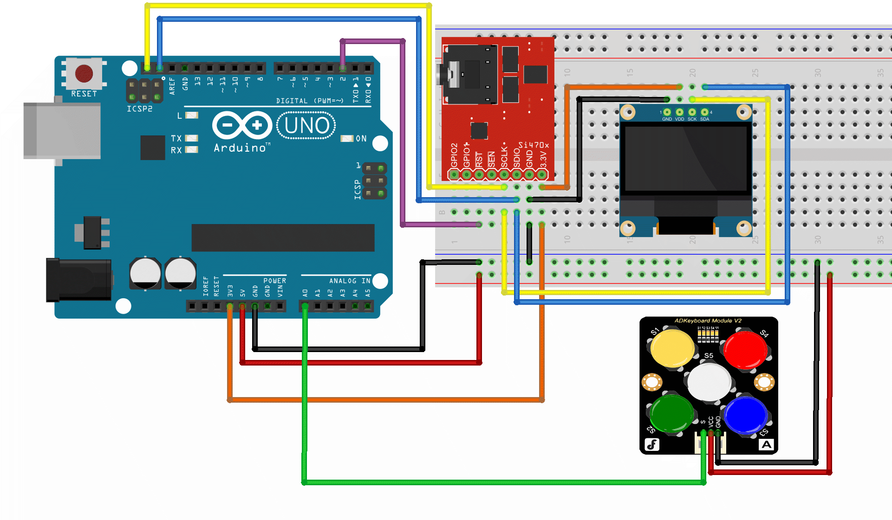

# FM-radio-receiver-with-digital-tuning

## Team members
* Mezera Vojtěch
* Moravec David
* Pavlíček Michal
* Mostecký Filip

## Abstract
The main objective of this project is to implement fully functional FM radio receiver with digital tuning on ATmega328P-based Arduino Uno board.
The tuner module Si4703 is controlled over the I2C bus. I2C OLED display is used for the main user interface.
Basic push buttons are used for controlling the receiver. This project also features the RDS (Radio Data System) to show the station name and radio text.  

## 1. Hardware

### Used components
* **Arduino UNO**
  – main microcontroller  
* **FM radio tuner module Si4703 with RDS**  
  - Receives FM broadcast band, approx. 87.5 - 108 MHz  
  - Provides support for RDS
* **OLED display 128x64 1.3" I2C**  
  - Main user interface
  - Displays tuned frequency, station name and text it's text (if avaible)
  - Also shows status messages such as scanning progress or number of found stations
* **ADKeyboard Module V3** – five-button input on a single analog pin

### Connections
- **SI4703**  
  - SDA → A4  
  - SCL → A5  
  - GND → GND  
  - VCC → 3.3 V  

- **OLED (I2C)**  
  - SDA → A4  
  - SCL → A5  
  - GND → GND  
  - VCC → 5 V  

- **ADKeyboard Module V3**  
  - Analog out → A0  
  - VCC → 5 V  
  - GND → GND  

## 2. Button Control

- **S1** – increase frequency / next station  
- **S2** – decrease frequency / previous station  
- **S3** – volume down  
- **S4** – volume up  
- **S5** – toggle tuning mode (AUT ↔ MAN)

## 3. Radio Functions

### Automatic Mode (AUT)
- Default at startup  
- Scans FM band, evaluates signal via `si4703_getRSSI()`  
- **Threshold: 19** (0–127); stations ≥19 saved to list  
- **S1/S2** cycle through list (wrap-around enabled)  

### Manual Mode (MAN)
- Activated by **S5**  
- **S1**: +0.1 MHz, **S2**: –0.1 MHz  

### Volume
- **S3**: down, **S4**: up  
- Value shown on OLED display

### RDS
- Displays station text if available  
- Updates dynamically; shows last valid text or if unavailable, `---`

## 4. Program Workflow

1. **Initialization**  
   - Configure I2C (SI4703 + OLED)  
   - Start automatic scan  

2. **Scanning**  
   - Sweep FM band  
   - Save stations with RSSI ≥19  

3. **Main Loop**  
   - Read button input (ADC)  
   - Adjust frequency or station list (AUT/MAN)  
   - Update OLED (frequency, mode, volume, RDS)  
   - Monitor signal strength  

## 5. Display Layout

- **Top line**: mode (AUT/MAN), frequency, volume
- **Middle part**: Radio name from RDS
- **Lower section**: RDS text  

## 6. Notes

- **RSSI threshold** fixed at 19  
**RDS reception**: text is shown only while valid RDS data is being received; if unavailable, `---` is displayed  
- **RDS latency**: data may arrive with delay; keep last valid text until new data is available  
- **ADKeyboard**: distinguish buttons by ADC voltage mapping  
- **Debouncing** recommended in software  
- **Memory**: station list in RAM; EEPROM optional  
